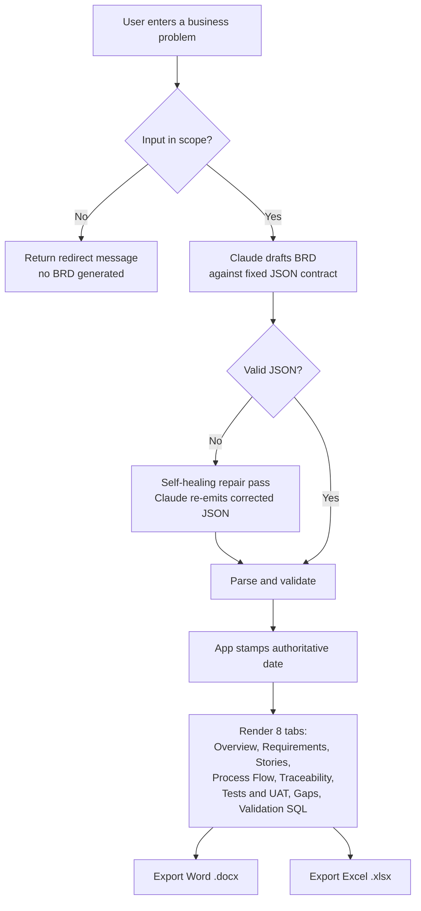

# BRD Copilot

Turn a plain-English business problem into a complete, traceable **Business Requirements Document** — functional and non-functional requirements, user stories with Given/When/Then acceptance criteria, a requirements traceability matrix, test scenarios with a UAT plan, a gap/ambiguity log, and data-validation SQL — rendered on screen and exportable to **Word** and **Excel**.

Built with Streamlit + the Claude API. The human is the Business Analyst; Claude is the drafting engine working against a fixed, validated contract.

---

## Problem

Requirements work fails in predictable ways: vague asks ("make it faster"), missing acceptance criteria, requirements that can't be traced to a test, and gaps nobody noticed until UAT. Writing a thorough BRD by hand is slow, and the structure (traceability, testability, completeness) is exactly the part that gets skipped under time pressure.

BRD Copilot front-loads that rigor. You describe the problem; it returns a structured BRD where every functional requirement traces to a user story and a test case, every acceptance criterion is testable, and the ambiguities in your own request are surfaced back to you as specific clarifying questions.

## Who it's for

Business Analysts, Product Owners, and delivery leads who need to move from a high-level business goal to an implementation-ready specification quickly, without sacrificing completeness or traceability.

## Goals

- Produce an implementation-ready BRD from a single problem statement.
- Enforce **traceability** by construction: objective → requirement → user story → test case.
- Make every requirement **testable** (Given/When/Then acceptance criteria).
- **Surface ambiguity** instead of hiding it — flag vague, incomplete, untestable, or conflicting items with a clarifying question for each.
- Support **QA partnership** with ready-to-use test scenarios and a UAT entry/exit plan.
- Validate **data-driven requirements** with sample ANSI SQL checks.
- Deliver a polished **Word** document and an **Excel** traceability workbook a stakeholder can actually use.

## Non-goals

- It does not replace stakeholder elicitation — it accelerates and structures it, and tells you what to go ask.
- It is not a project-management or ticketing tool.
- It does not execute the generated SQL; the SQL is a validation aid for analysts and QA.

---

## How it works



The model is constrained to return **one JSON object** matching a fixed schema. The app validates it, repairs it if malformed, stamps the document date itself (the model is never trusted for facts the system already knows), then renders and exports.

---

## Key design decisions

These are the engineering choices behind the product, and the rationale for each.

**1. A fixed JSON contract is how you write acceptance criteria for non-deterministic output.**
The model must return a single JSON object matching a defined schema (document control, business context, scope, stakeholders, functional/non-functional requirements, user stories, process flow, traceability matrix, test scenarios, UAT, gap log, validation SQL). The app validates against that shape. If the output doesn't conform, it fails gracefully rather than rendering garbage. This is the same discipline a BA applies to any requirement: define what "done" looks like before you accept the work.

**2. Traceability is enforced in the contract, not added afterward.**
Functional requirements, user stories, and test cases share IDs (`FR-01`, `US-01`, `TC-01`), and the prompt requires every functional requirement to trace to at least one story and one test case. Traceability is a property of the generated document by construction, not a manual reconciliation step.

**3. The system owns facts it already knows.**
The document date is stamped by the application using the host clock, overwriting whatever the model produces. Models hallucinate dates; the app shouldn't trust them for information it already has. The same principle governs IDs and any value that must be authoritative.

**4. Graceful degradation via a self-healing repair pass.**
Large structured generations occasionally emit slightly invalid JSON (a stray quote inside a SQL string, a missing comma). On a parse failure, the app sends the candidate back to the model with an instruction to return only corrected JSON, then tries once more before surfacing an error. The system recovers instead of dead-ending.

**5. A scope guardrail keeps the tool honest.**
Off-topic input sets `scope_ok = false` and returns a redirect message instead of fabricating a BRD for a non-requirements problem.

**6. Ambiguity is a first-class output.**
The gap log is not an afterthought — the model is required to surface vague, incomplete, untestable, or conflicting items in the source request, each paired with a specific clarifying question. The tool tells you what you still need to ask.

---

## Features

- **8-tab interactive view:** Overview, Requirements, User Stories, Process Flow, Traceability, Tests & UAT, Gaps, Validation SQL.
- **MoSCoW prioritization** on functional requirements.
- **Requirements Traceability Matrix** linking objectives → requirements → stories → tests.
- **Test scenarios + UAT entry/exit criteria** for QA partnership.
- **Gap & ambiguity log** with clarifying questions.
- **Data-validation SQL** for data-driven requirements (row-count reconciliation, null checks, aggregate parity, referential integrity).
- **Word export** with a title page and an auto-generating Table of Contents.
- **Excel export** with separate sheets for requirements, traceability, test scenarios, and gaps.
- **Model selector:** Sonnet (default), Opus, or Haiku.

## Tech stack

- **Streamlit** — UI and app runtime
- **Anthropic Claude API** — BRD generation
- **python-docx** — Word export (title page + TOC field)
- **openpyxl** — Excel export (multi-sheet workbook)

## Running locally

```bash
python -m venv venv
venv\Scripts\activate          # Windows
pip install -r requirements.txt
```

Create `.streamlit/secrets.toml` (this file is gitignored — never commit it):

```toml
ANTHROPIC_API_KEY = "sk-ant-your-key-here"
```

Run:

```bash
python -m streamlit run app.py
```

## Deployment

Deployed on Streamlit Community Cloud. The API key is set in the app's **Settings → Secrets** dashboard (the local `secrets.toml` does not deploy). The secret name must match `st.secrets["ANTHROPIC_API_KEY"]` exactly.

## Mapping to the Business Analyst role

| BA competency | Where it shows up |
|---|---|
| Requirements gathering, documentation, refinement | Full BRD output from a single problem statement |
| Translate goals into stories + acceptance criteria | User stories with Given/When/Then criteria |
| Completeness, clarity, traceability | Traceability matrix enforced by shared IDs |
| Eliminate ambiguity, no "magic solutions" | Gap & ambiguity log with clarifying questions |
| Partner with QA on test scenarios & coverage | Test scenarios + UAT entry/exit plan |
| Validate data-driven requirements (SQL a plus) | Generated ANSI SQL validation checks |
| Tradeoffs: business value vs. effort vs. timing | MoSCoW prioritization with rationale |
